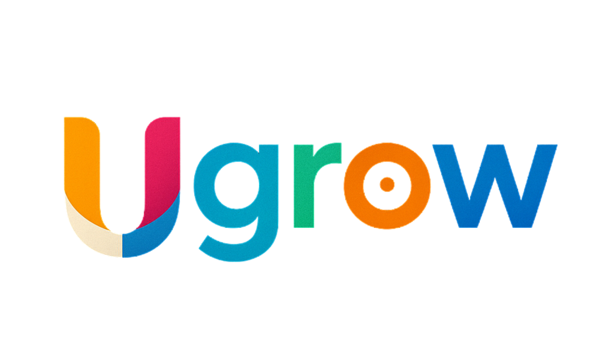

---

- [Ugrow Social App (EN)](#ugrow-social-app-en-1)
    ---
    - [Description](#description-1)
        ---
        
    - [Repositories](#repositórios-1)
        ---
        - [Ugrow's Documentation](#ugrows-documentation)

- [Ugrow Aplicativo Social (PT-BR)](#ugrow-aplicativo-social-pt-br-1)
    ---
    - [Descrição](#descrição)
        ---
    - [Repositórios](#repositórios-1)
        ---
        - [Documentação do Ugrow](#documentação-do-ugrow)
    - [Cronograma de Atividades](#cronograma-de-atividades-1)
        ---

# Ugrow Social App (EN)

## Description

This GitHub organization refers to the digital solution called Ugrow. This solution was created from the need for people to manage their finances and learn at least the basics of personal finance. All application documentation, user manuals, and other relevant information are available within this organization’s repositories.

This academic project was created and developed by Guilherme Veiga Pedromilo during his undergraduate studies in Software Engineering at Universidade Cesumar.

## Repositories

- ### [Ugrow's Documentation](https://github.com/Ugrow-Social-App/Ugrow_Documentation)

    This repository contains all academic and technical documentation of the social innovation project Ugrow App, including system requirements, selected architecture, user manual, and related materials.

## Activity Schedule

The [project schedule](https://github.com/orgs/Ugrow-Social-App/projects/2/views/4) contains all activities related to the project. It allows users to track completed tasks, ongoing work, and deadlines. The schedule is publicly accessible and kept up to date with the distribution of new versions.

# Ugrow Aplicativo Social (PT-BR)

## Descrição

Esta organização no GitHub se refere a solução digital chamada Ugrow. Esta solução nasce da necessidade das pessoas em controlar suas finanças e aprenderem pelo menos o básico sobre finanças pessoais. Toda a documentação do aplicativo, manual do usuário e outras informações constam dentro dos repositórios desta organização.

Este projeto acadêmico foi criado e desenvolvido por Guilherme Veiga Pedromilo, durante sua graduação - Bacharelado em Engenharia de Software pela a Universidade Cesumar.

## Repositórios

- ### [Documentação do Ugrow](https://github.com/Ugrow-Social-App/Ugrow_Documentation)
    Este repositório contém toda a documentação acadêmica e técnica do projeto de inovação social: Aplicativo Ugrow - ou seja, todos os requisitos, arquitetura escolhida, manual do usuário, etc.

## Cronograma de Atividades

O [cronograma do projeto](https://github.com/orgs/Ugrow-Social-App/projects/2/views/4) é o documento que consta todas as atividades relacionadas ao projeto. Aqui é possível ver o que foi feito, o que está em andamento e prazos, sendo aberto a todos para visualizar e estar atualizado com a distribuição de novas versões.